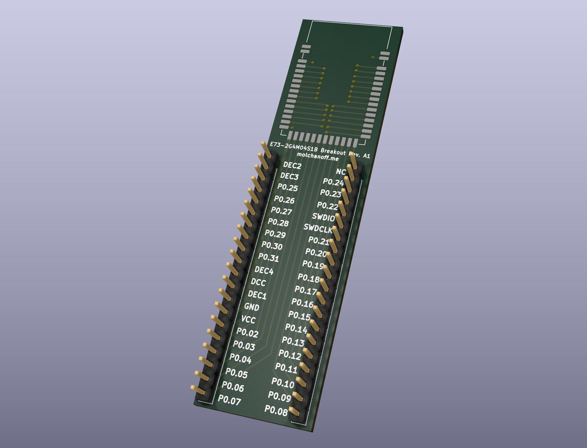
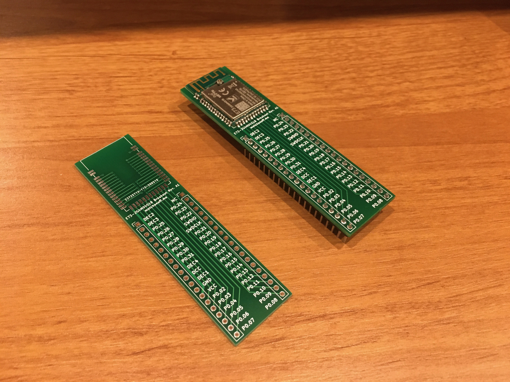
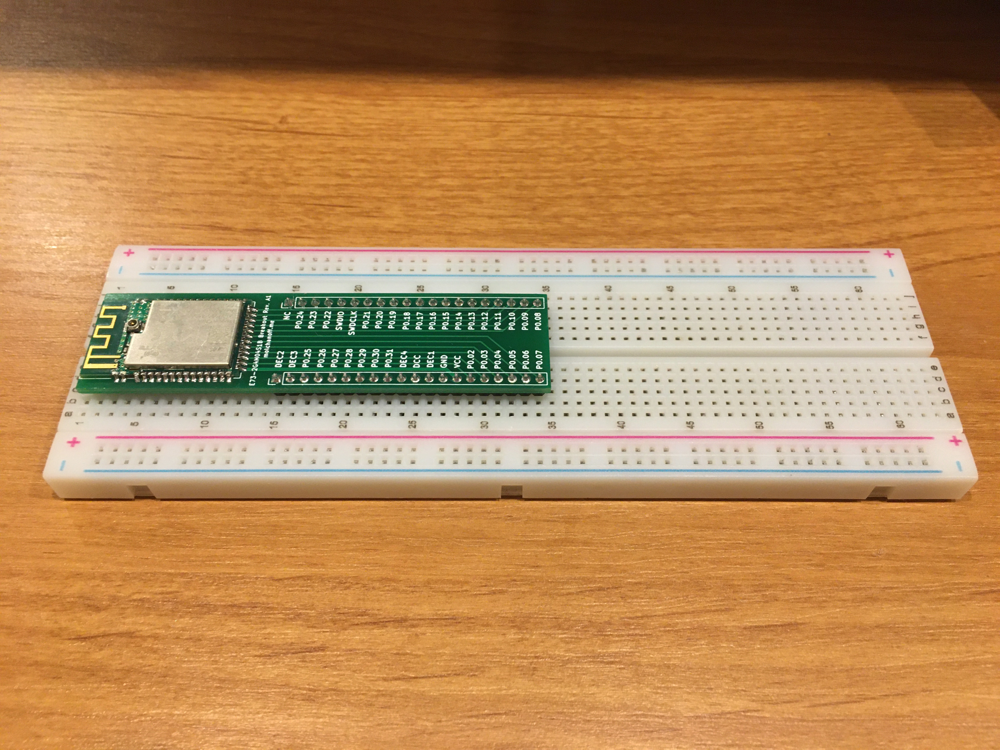

# E73-2G4M04S1B nRF52832 breakout board

This is a simple breakout board for E73-2G4M04S1B Bluetooth module based on nRF52832 SoC: http://www.ebyte.com/en/product-view-news.aspx?id=243 which is intended to fit a breadboard with standard 2.54mm spacing.

